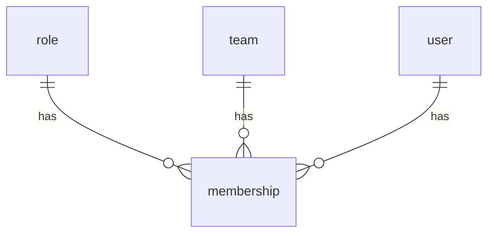
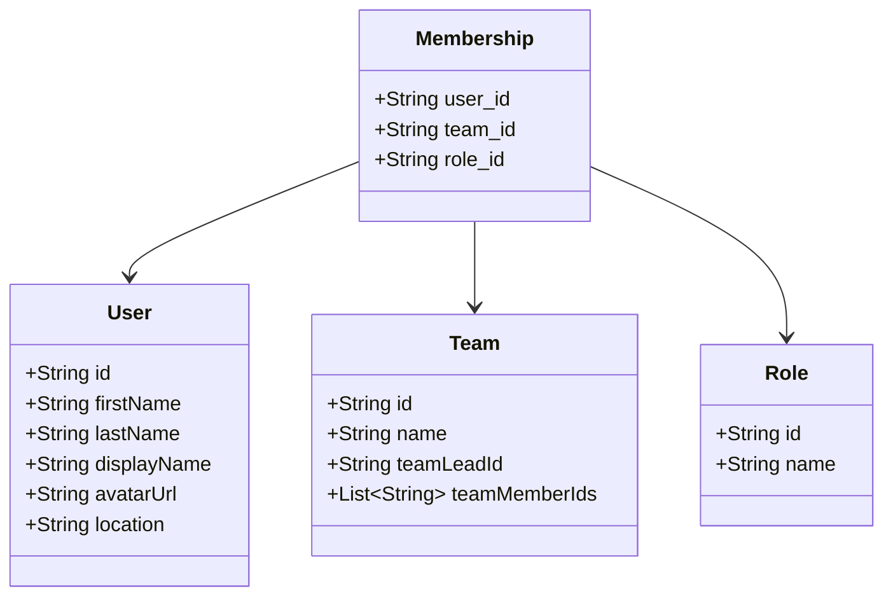
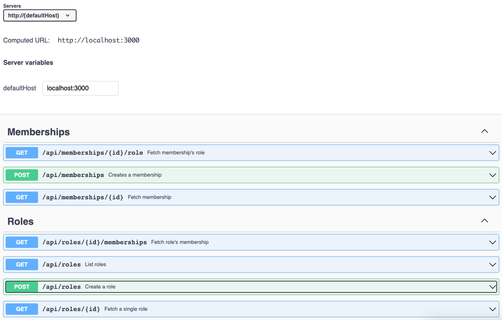

# Roles

This service is responsible for managing the roles of the users.

It enhances the `Users` and `Teams` services, by giving us the concept of team
roles and  the ability to associate them with team members.

> Note: This service doesn't hold any **Team** or **User** table as they are
> managed by their respective services.

## Stack

- Ruby on Rails 7.0 (API mode)
- PostgreSQL 13
- Rspec
- Docker + Composer

## Setup

> **Before proceding, make sure that you have `docker` and `docker-compose`
installed. See https://docs.docker.com/compose/install/ for more information.**

All you need to do is build the images and run the containers.

You can either run:

```shell
chmod +x bin/setup.sh
sh bin/setup.sh
```

Or run the commands one by one:
Build images:
```shell
docker compose build
```

### Database

> If this is the first time running the app, run all following commands.

#### Create the database
```shell
docker compose run --rm api bin/rails db:create
```

#### Running migrations
```shell
docker compose run --rm api bin/rails db:migrate
docker compose run --rm api bin/rails db:migrate RAILS_ENV=test
```

#### Adding data
```shell
docker compose run --rm api bin/rails db:seed
```

## Running the app

```shell
docker compose up
```

## Testing

Testing the application is pretty simple, it uses Rspec and you can run the
tests with docker:

```shell
docker compose run --rm api bundle exec rspec
```

Or, if you have everything set locally:

```shell
bundle exec rspec
```

## Accessing the app

- Rails API: http://localhost:3000

## Documentation

The documentation is generated by Swagger and it's available at
http://localhost:3000/api-docs/index.html.

You can also check extra documentation at `docs/` folder.

### Postman

If you are a Postman user, there's a Postman collection available at
`docs/postman_collection.json` that you can import to Postman and test the
endpoints manually.

### Updating documentation

```shell
rake rswag:specs:swaggerize
```

### Starting new documentation

You can generate a initial documentation for an existing controller like this:
```shell
rails generate rspec:swagger <controller_name>
```

for instance

```shell
rails generate rspec:swagger Api::MembershipsController
```

## Final considerations

### How I approached the problem

#### Requirements

Initially, I read the requirements and tried to understand what was being asked.
Then, I started to think about the best way to implement it and created some
diagrams such as Entity Relationship Diagram (ERD) and Class Diagram, both
available at `docs/` folder, but I added them here for better visualization.



As you can see, the `membership` table has a `user_id`, `team_id` and `role_id`
columns, which means that a membership is defined by a `user` and the user's
`role` in a `team`. A membership cannot exist without a `user`, `team` and
`role`.

A `role`, `user`, and `team` can have many `memberships` or none. In theory,
a `team` should have at least one membership to exist, but I didn't add any
validation for that as it's not this service responsibility.



I created the class diagram to help me visualize the fields that each model
should have.

#### Setup
After that, I setup the project with Docker, Docker Compose and GitHub actions.
With that, for every commit I made, rubocop and rspec would run to make sure
that the code was following the style guide and that the tests were passing.

#### Development

If you follow the commit history, you'll notice that I started by creating the
models and migrations, then I created the endpoints and lastly I created the
documentation.

One silly mistake that I did was creating the `team` and `user` tables, but
after reading the requirements again I noticed that they should be managed by
their own services, so I removed them via migrations.

#### Documentation

This is the first time I used Swagger and `rswagger`, so I am not used with
it yet. I would like to improve the documentation to make it more clear and
easy to understand while making it cleaner & DRYer code-wise.

Currently the "Try it out" feature is not working, but it would be nice to have it
working so other users could easily test the endpoints.

You can check the respective documentation by running the application and
accessing http://localhost:3000/api-docs/index.html.

Here's an example of the documentation running locally:


### Improvements for Team and User services

It's hard to suggest any improvements without knowing them better, but if they
are written in Ruby, I would suggest to refactor their fields naming to use
snake_case instead of camelCase. It's a convention in Ruby to use snake_case.

Additionally, I am not sure if it's implemented yet, but I would suggest to
add pagination to the endpoints that return a list of records. It's a good
practice to avoid returning a huge amount of data in a single request.

Lastly, if such services/apis are not public, I would suggest to add some
authentication mechanism to them to avoid unauthorized access.

### Code notes

- `Roles.default` name might sound worst then `default_role`, but if I did such
  it would return SystemStackError as `find_or_create_by!` also calls `default_role`.

- It was not part of the scope, but I added the `Roles#index` endpoint to make it
  easier to fetch all existing roles

- I don't like the idea of applying a "default" role if none is informed is a
  good idea as it's not possible to edit or delete them. In a real scenario I would
  confirm if this is the ideal behavior. But since I only got the requirements
  I am following it to not add extra work or something that was not asked.

- I forgot to normalize the Role's name before saving it to the database. A few
nice normalizations would be to remove trailing spaces, capitalize the first letter
of each word, and remove special characters.

### Future improvements suggestions

- Limit the returned attributes to as minimum as possible. E.g, only return the
  id and name of the role instead of all attributes. If this is a public
  API, we don't want to expose all the attributes of the models.

- Add SimpleCov or something alike to integrate in the CI/CD pipeline and set
  thresholds for code coverage, so we can make sure that the code coverage is
  always above a certain percentage.

- Add upper limit for pagination so we don't return a huge amount of data in a
  single request.

- Currently is not possible to edit/delete a role nor memberships, but it would
be nice to have such feature as currently if you do a mistake by adding the wrong
role to a membership, or have a typo in the roles name you cannot fix it.