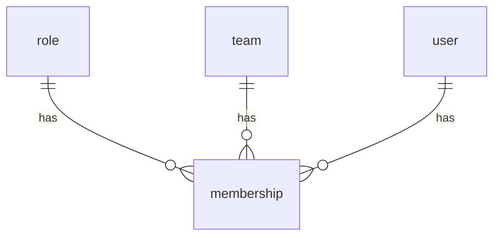
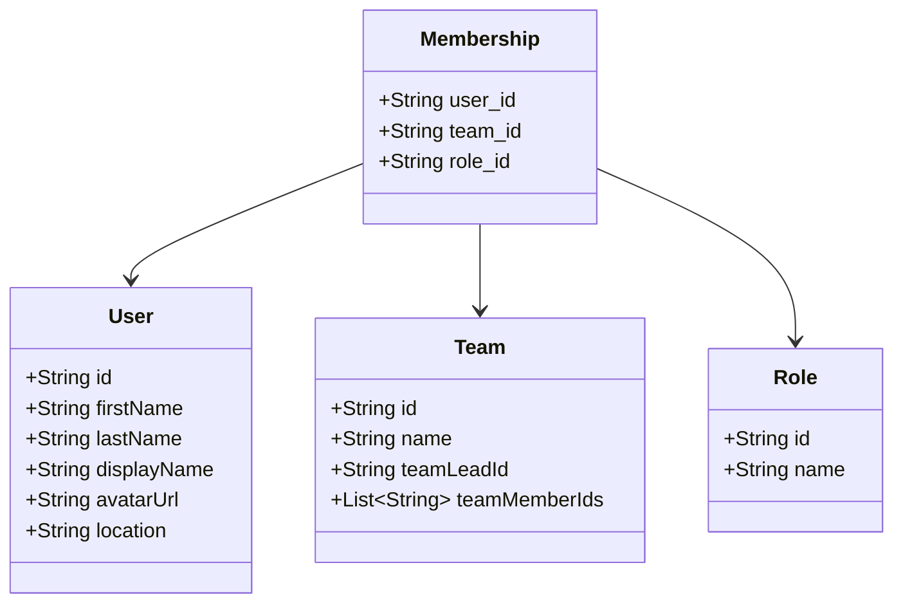

# Membership

A membership is defined by a `user` and the user's `role` in a  `team`.
Once the membership is created, it means that the `user` is part of the `team`
and has a specific `role` in it.

## Entity Relationship Diagram

## Class Diagram

